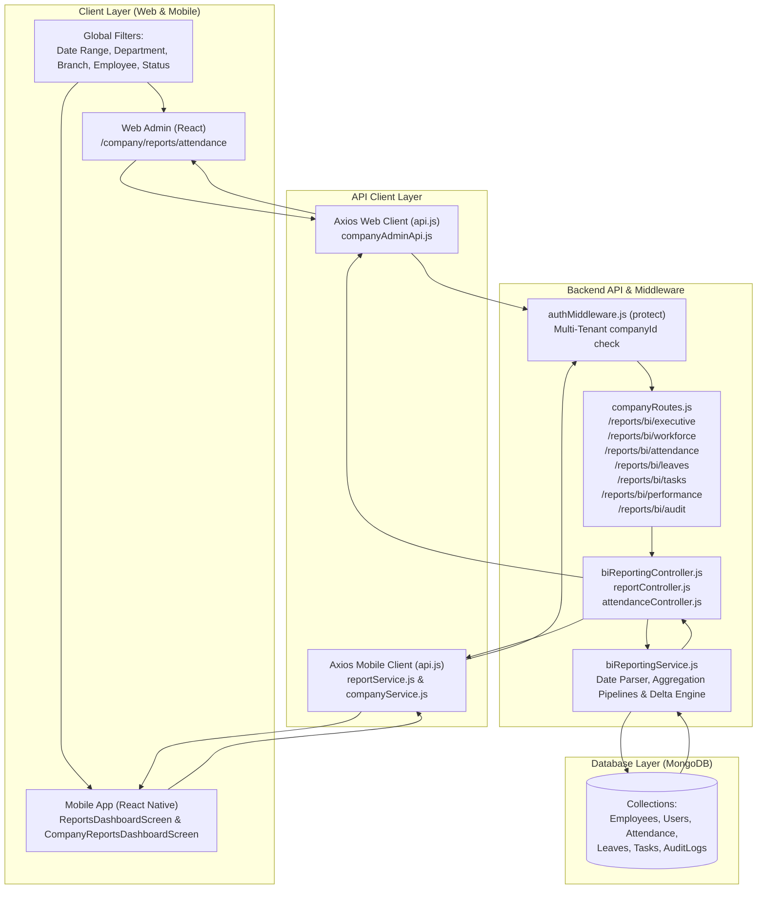

# One Click HRMS — Reports & Analytics Architecture & Data Flow

This document provides a comprehensive technical overview and flow breakdown of the reporting and analytics subsystem across the **Frontend (Web)**, **Backend (Node/Express/MongoDB)**, and **Mobile (React Native/Expo)** applications.

> **CRITICAL ARCHITECTURE NOTE**:
> **Payroll is completely removed from the Reports & Analytics module.**
> No Payroll tab, card, section, filter, chart, table, or export option exists in Reports. Payroll features remain solely within the dedicated Payroll Management section.

---

## 1. System Architecture Overview

---

## 2. File Directory & Component Index

### Frontend (Web)
| File Path | Description |
| :--- | :--- |
| `frontend/src/pages/companyadmin/Reports.jsx` | Main unified **Reports & Analytics** dashboard focused on core business intelligence: Executive Overview, CRM & Leads, Projects Portfolio, Tasks & Operations, Workforce, and Performance. (Attendance, Leaves, and Audit Ledger are excluded from this tab bar as they are serviced by dedicated sidebar screens). Includes strict permission gating and genuine `.xlsx` Excel export. |
| `frontend/src/api/companyAdminApi.js` | API endpoints calling `/company/reports/bi/*` including `/bi/leads` and `/bi/projects`. |
| `frontend/src/components/layout/Sidebar.jsx` | Navigation sidebar routing to Reports & Analytics (`/company/reports`). |
| `frontend/src/routes/AppRoutes.jsx` | Route definitions mapping `/company/reports` to `<Reports />`. |

### Backend
| File Path | Description |
| :--- | :--- |
| `backend/src/routes/companyRoutes.js` | Express router exposing `/reports/bi/executive`, `/bi/leads`, `/bi/projects`, `/workforce`, `/attendance`, `/leaves`, `/tasks`, `/performance`, `/audit`. |
| `backend/src/controllers/biReportingController.js` | Controller extracting tenant credentials and dispatching to reporting services. |
| `backend/src/services/biReportingService.js` | Core business logic, MongoDB aggregation pipelines, date range parsing (`DD/MM/YYYY`), overtime calculations, lead pipelines, project delivery velocity, department/employee breakdowns, and delta metrics. |
| `backend/src/controllers/attendanceController.js` | Real-time attendance logging, daily check-in/out, and location geofencing. |

### Mobile Application
| File Path | Description |
| :--- | :--- |
| `mobile/src/screens/company/CompanyReportsDashboardScreen.js` | Company admin executive overview with business health score, 6-month trends, dynamically filtered KPI metrics, and report navigation (zero payroll). |
| `mobile/src/screens/reports/ReportsDashboardScreen.js` | Central mobile report hub navigation for Leads, Attendance, Leaves, Tasks, Projects, Workforce, and Performance. |
| `mobile/src/screens/reports/LeadReportScreen.js` | Mobile CRM & Leads report with KPI cards, pipeline stages, status filters, search, and Excel/PDF export. |
| `mobile/src/screens/reports/ProjectReportScreen.js` | Mobile project progress and schedules report with Excel/PDF export. |
| `mobile/src/screens/reports/AttendanceReportScreen.js` | Mobile employee monthly summary & daily punch logs with Excel export. |
| `mobile/src/screens/reports/LeaveReportScreen.js` | Mobile leave balances, applications, and status metrics. |
| `mobile/src/screens/reports/TaskReportScreen.js` | Mobile task workload, status tracking, and department breakdowns. |
| `mobile/src/screens/reports/EmployeeReportScreen.js` | Mobile workforce directory, joinings, and department headcount. |
| `mobile/src/screens/reports/PerformanceReportScreen.js` | Mobile employee productivity scorecards and leaderboard rankings. |
| `mobile/src/screens/manager/ManagerReportsScreen.js` | Manager reporting dashboard (zero payroll). |
| `mobile/src/utils/excelExporter.js` | Mobile genuine Excel (.xlsx) file generator and device share utility. |

---

## 3. Dynamic Access & Module Licensing Gating

The reporting module implements strict multi-layer access control:
1. **Subscription Plan Check**: Checks `user.company.subscribedModules`. If the company does not subscribe to a module (e.g., `leads` or `projects`), the corresponding report tab and overview cards are completely omitted.
2. **User Permission Check**: Evaluates `user.assignedModules` and `hasPermission(moduleName)`. Staff without access to a module are restricted from seeing its reports.
3. **Graceful Fallback**: If a user switches to a tab they lack permission for, the system automatically redirects to the first authorized tab.

---

## 4. The Complete Core Reports Suite

### 1. Executive / Business Report (`getExecutiveMetrics`)
- **Total Employees & Active Employees**: Headcount active vs total under `companyId`.
- **Task Overview**: Total Tasks, Completed Tasks, Pending Tasks, and Overdue Tasks with delta trends (+/- %).
- **Cross-Functional Leads & Projects**: Displays CRM Inquiries and Active Projects widgets when enabled.
- **Attendance Rate (%)**:
  $$\text{Attendance Rate} = \frac{\text{Present Count}}{\text{Total Working Days} \times \text{Active Employees}} \times 100$$
- **Task Completion Rate (%)**:
  $$\text{Task Completion Rate} = \frac{\text{Completed Tasks}}{\text{Total Tasks}} \times 100$$
- **Department Workforce**: Staff headcount and task distribution by department.
- **Top Performing Employees Leaderboard**: Ranked by composite productivity scores.

### 2. CRM & Leads Report (`getLeadMetrics`)
- **Summary KPIs**: Total Leads, Converted Deals, Active Pipeline, Lost Leads, Conversion Rate (%), Total Pipeline Value (₹), Closed Revenue Won (₹), and Average Deal Size.
- **Pipeline Stage Breakdown**: Volume distribution across New, Contacted, Qualified, Proposal, Won, and Lost.
- **Acquisition Source Share**: Pie chart distribution (Website, Referral, Inbound Call, Social, Direct).
- **Sales Representative Matrix**: Rep performance table with assigned leads, deals won, conversion %, and revenue closed.
- **Detailed Leads Ledger**: Searchable customer inquiry list with contact numbers, sources, assigned agents, estimated values, and creation dates (`DD/MM/YYYY`).

### 3. Project Portfolio Report (`getProjectMetrics`)
- **Summary KPIs**: Total Projects, Active Projects, Planning Phase, Completed Projects, Overdue Projects, and On-Time Delivery Rate (%).
- **Project Status Breakdown**: Bar chart covering Active, In-Progress, Planning, On-Hold, Completed, and Cancelled.
- **Priority Distribution**: High, Medium, and Low allocations.
- **Department Workload**: Active project count per department.
- **Detailed Project Ledger**: Comprehensive tracking table with client name, manager, department, priority, milestones % progress bar, status badges, and timeline (`DD/MM/YYYY`).

### 4. Workforce Report (`getWorkforceMetrics`)
- **Headcount Overview**: Total Employees, Active Employees, New Joinings (within date range), Resigned/Inactive Employees.
- **Department-wise & Branch-wise Employee Count**: Grouped aggregations.
- **Employee Directory**: Full tabular listing with Employee ID, Full Name, Email, Department, Designation, Branch, Status, and Joining Date (`DD/MM/YYYY`).

### 5. Attendance Report (`getAttendanceMetrics`)
Includes a sub-view toggle:
- **A. Monthly Employee Summary**:
  - Employee Name, Employee ID, Department
  - Total Working Days
  - Present Days, Absent Days, Half Days
  - Approved Leave Days, Weekly Offs, Holidays
  - Late Arrival Count
  - Total Work Hours
  - Overtime Hours (calculated when daily total hours > 8 hours: $\text{Overtime} = \max(0, \text{Total Hours} - 8)$)
  - Attendance Rate (%)
- **B. Daily Punch Logs**:
  - Date (`DD/MM/YYYY`), Employee Name, Employee ID, Department
  - Shift Name, In Time (`hh:mm A`), Out Time (`hh:mm A`)
  - Status (Present, Late, Absent, Half-Day, On Leave, Weekly Off, Holiday)
  - Total Work Hours, Overtime Hours, Check-in/Check-out Locations & IP

### 6. Leave Report (`getLeaveMetrics`)
- **Summary KPIs**: Total Leaves Requested, Approved, Pending, Rejected, Approval Rate (%).
- **Leave Type Breakdown**: Casual, Sick, Earned, Unpaid counts and durations.
- **Department Breakdown**: Total requests and approval distributions by department.
- **Employee Breakdown**: Employee-level leave consumption ledger with start date, end date, and reason.

### 7. Task & Operations Report (`getTaskMetrics`)
- **Metrics**: Total Tasks, Completed, In Progress, Pending, Overdue.
- **Priority Breakdown**: Urgent, High, Medium, Low tasks.
- **Department Analytics**: Volume assigned, completion rate, and overdue task count per department.
- **Employee Performance**: Assigned tasks, completed tasks, and completion % per team member.
- **Detailed Task Ledger**: Title, Assignee, Department, Priority, Status, Due Date, and Completion Date.

### 8. Performance Report (`getPerformanceMetrics`)
Weighted multi-metric scoring:
- Task Completion Rate (30%)
- Attendance Consistency (20%)
- Productivity & Speed (20%)
- Punctuality / On-Time Check-in (15%)
- Leave Discipline (15%)

Composite Score:
$$\text{Composite Score} = \sum (\text{Metric Score} \times \text{Weight \%})$$

Performance Tiers:
- **Tier 1 (A+)**: 90% – 100%
- **Tier 2 (A)**: 80% – 89%
- **Tier 3 (B)**: 70% – 79%
- **Tier 4 (Needs Improvement)**: < 70%

### 9. Audit Report (`getAuditLedger`)
- Immutable log tracking changes made by administrators, HR, and managers.
- Records: Date & Time (`DD/MM/YYYY hh:mm A`), User Name, Role, Module, Action, and IP Address.
- Read-only table with module, date-range, and user filters.

---

## 4. Excel (.xlsx) Export Engine

Both Web and Mobile use genuine binary `.xlsx` generation using the `xlsx` library:
- **Proper Column Headers**: Clear, capitalized column names.
- **Summary Rows**: Includes total summary statistics at the top.
- **Auto-fit Column Widths**: Dynamically sized columns based on maximum cell string length.
- **Sanitized Values**: Zero `NaN`, `null`, or `undefined` values.
- **Formatted Dates**: Uniform `DD/MM/YYYY` format across all export sheets.
